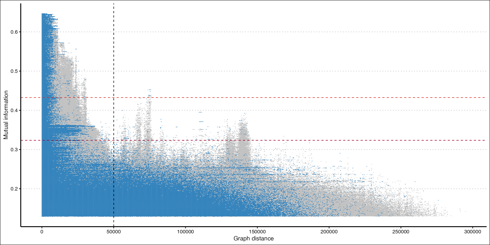

---
output:
  pdf_document: default
  html_document: default
---
PAN-GWES (with Conda installation)
================

<!-- badges: start -->

<!-- badges: end -->

# Introduction

The original PAN-GWES repo is located
[here](https://github.com/jurikuronen/PANGWES). This *duplicate* repo
provides a quick and easy interface for installation and testing.

# Installation

## Bioconda (Recommended)

<!-- badges: start -->

<!-- badges: end -->

1.  If you haven’t already, first, you will need to install
    [conda](https://docs.anaconda.com/free/miniconda/miniconda-install/)
    or recommended:
    [mamba](https://mamba.readthedocs.io/en/latest/installation/mamba-installation.html).

<!-- -->

    conda create -n pangwes
    conda activate pangwes
    mamba install -c bioconda -c conda-forge pangwes

> If you installed conda, run the last command using conda inplace of
> mamba.

If you are an ARM-64 user (Macs with M series chips), please follow
these steps to [change your channel to
osx-64](https://stackoverflow.com/questions/71515117/how-to-set-up-a-conda-osx-64-environment-on-arm-mac):

    conda create -n pangwes
    conda activate pangwes
    conda config --env --set subdir osx-64
    conda install -c bioconda -c conda-forge pangwes

> It is recommended to use the conda command (instead of mamba) for
> installation after channel change.

## Local Conda Installation

1.  If you haven’t already, first, you will need to install
    [conda](https://docs.anaconda.com/free/miniconda/miniconda-install/).
2.  Next, install [conda build
    tools](https://docs.conda.io/projects/conda-build/en/stable/install-conda-build.html):

<!-- -->

    conda activate base
    conda install conda-build

3.  Clone the repo

<!-- -->

    git clone https://github.com/Sudaraka88/PAN-GWES

> Alternatively, you can click the \<\>Code button at the top right and
> click Download ZIP. Afterwards, unzip the repo.

### Linux-64 and osx-64 (Intel Macs)

4.  Build the repo

<!-- -->

    cd PAN-GWES
    conda build -c bioconda -c conda-forge sw

5.  Create a new environment and install the package

<!-- -->

    conda create -n pangwes -c bioconda -c conda-forge pangwes --use-local

> When prompted, enter y to confirm the installation of pangwes and
> dependencies

### ARM-64 (Macs with M series chips)

[SpydrPick](https://anaconda.org/bioconda/spydrpick) and
[Cuttlefish](https://anaconda.org/bioconda/cuttlefish) are available via
bioconda as osx-64 dependencies. You can [create a conda environment
that uses the osx-64
channel](https://stackoverflow.com/questions/71515117/how-to-set-up-a-conda-osx-64-environment-on-arm-mac).
Follow steps 1-3 first, then:

4.  Create a new conda environment and change channels

<!-- -->

    conda create -n pangwes
    conda activate pangwes
    conda config --env --set subdir osx-64

5.  Build the package

<!-- -->

    cd PAN-GWES
    conda build -c bioconda -c conda-forge sw

6.  Install the package

<!-- -->

    conda install -c bioconda -c conda-forge pangwes --use-local

## Make and Install

Please refer to the original
[repo](https://github.com/jurikuronen/PANGWES)

# Example

There is a sample dataset available
[here](https://uio-my.sharepoint.com/:u:/g/personal/sudarakm_uio_no/ET0J10TDy9VCiIS8ymLFYxYBrN0IqxsE83iJzUl-9_SWpQ?e=YpKoPg).
This compressed file contains a single folder called
**efcls_assemblies**, which contains 337 *E. faecalis* assemblies.
**Uncompress** the downloaded file and move the **efcls_assemblies**
folder into your working directory.

1.  Open a terminal in your working directory and populate a list of
    these assemblies using the following command.

<!-- -->

    ls -d efcls_assemblies/* > efcls_assemblies.txt

2.  Activate the pangwes conda environment

<!-- -->

    conda activate pangwes

3.  Build the pangenome graph using cuttlefish

<!-- -->

    cuttlefish build --list efcls_assemblies.txt --kmer-len 61 --output efcls --threads 16 -f 1

> You can provide an optional work directory to store temporary files
> using –work-dir <your directory> and adjust the number of threads
> depending on your system resources. If you run into the error “Cannot
> open temporary file ./kmc_01021.bin”, run `ulimit -n 2048` in the
> terminal. See
> [here](https://github.com/COMBINE-lab/cuttlefish/issues/29#issuecomment-1491083656)
> and [here](https://github.com/refresh-bio/KMC/issues/140).

4.  Prase the built gfa1 file

<!-- -->

    gfa1_parser efcls.gfa1 efcls

> Warning! The next couple of steps will take a bit of time. Remember to
> adjust the number of threads depending on your system resources.

5.  Run SpydrPick on the unitig fasta alignment

<!-- -->

    SpydrPick --alignmentfile efcls.fasta --maf-threshold 0.05 --mi-values 50000000 --threads 16 --verbose

6.  Calculate unitig distances

<!-- -->

    unitig_distance --unitigs-file efcls.unitigs --edges-file efcls.edges --k-mer-length 61 --sgg-paths-file efcls.paths --queries-file efcls.*spydrpick_couplings*edges --threads 16 --queries-one-based --run-sggs-only --output-stem efcls --verbose

7.  Generate the pangenome Manhattan Plot

<!-- -->

    ./gwes_plot.r -i efcls.ud_sgg_0_based -n 337

> Warning! This script will try to install the required dependencies. Use 
> --no-deps to generate the plot without installing any packages (slower!).

If all went to plan, this example should generate the following figure:

