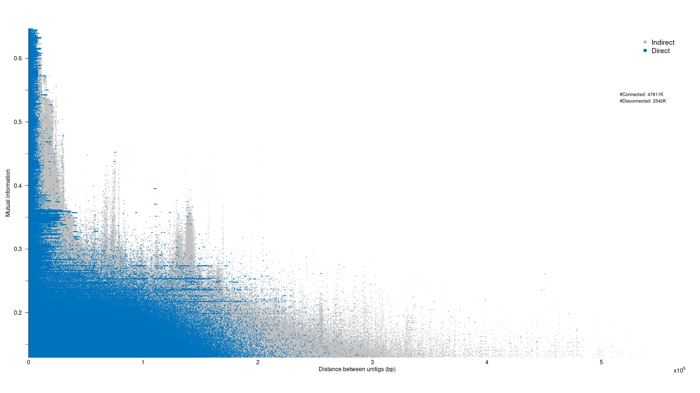

PANGWES Conda Installation
================

# Introduction

The original PANGWES repo is located
[here](https://github.com/jurikuronen/PANGWES). This repo provides a
quick and easy interface for installation and testing.

# Installation

This package will soon be available through bioconda, in the meantime,
you can build and install it locally using conda. Currently, this
package works on linux and mac osx-64 systems.

Please follow these steps:

1.  If you haven’t already, first, you will need to install
    [conda](https://docs.anaconda.com/free/miniconda/miniconda-install/).
2.  Next, install [conda build
    tools](https://docs.conda.io/projects/conda-build/en/stable/install-conda-build.html):

<!-- -->

    conda activate base
    conda install conda-build

3.  Clone the repo

<!-- -->

    git clone https://github.com/Sudaraka88/pangwes_conda

> Alternatively, you can click the \<\>Code button at the top right and
> click Download ZIP. Afterwards, unzip the repo.

4.  Build the repo

<!-- -->

    cd pangwes_conda 
    conda build -c bioconda -c conda-forge sw

5.  Create a new environment and install the package

<!-- -->

    conda create -n pangwes -c bioconda -c conda-forge pangwes --use-local

> When prompted, enter y to confirm the installation of pangwes and
> dependencies

# Example

There is a sample dataset available
[here](https://uio-my.sharepoint.com/:u:/g/personal/sudarakm_uio_no/ET0J10TDy9VCiIS8ymLFYxYBrN0IqxsE83iJzUl-9_SWpQ?e=YpKoPg).
This compressed file contains a single folder called *efcls_assemblies*,
which contains 337 *E. faecalis* assemblies. **Uncompress** the
downloaded file and move the **efcls_assemblies** folder into your
working directory.

1.  Open a terminal in your working directory and populate a list of
    these assemblies using the following command.

<!-- -->

    ls -d efcls_assemblies/* > efcls_assemblies.txt

2.  Activate the pangwes conda environment

<!-- -->

    conda activate pangwes

3.  Build the pangenome graph using cuttlefish

<!-- -->

    cuttlefish build --list efcls_assemblies.txt --kmer-len 61 --output efcls --threads 16 -f 1

> You can provide an optional work directory to store temporary files
> using –work-dir <your directory> and adjust the number of threads
> depending on your system resources.

4.  Prase the built gfa1 file

<!-- -->

    gfa1_parser efcls.gfa1 efcls

5.  Run SpydrPick on the unitig fasta alignment

<!-- -->

    SpydrPick --alignmentfile efcls.fasta --maf-threshold 0.05 --mi-values 50000000 --threads 16 --verbose

6.  Calculate unitig distances

<!-- -->

    unitig_distance --unitigs-file efcls.unitigs --edges-file efcls.edges --k-mer-length 61 --sgg-paths-file efcls.paths --queries-file efcls.*spydrpick_couplings*edges --threads 16 --queries-one-based --run-sggs-only --output-stem efcls --verbose

> Remember to adjust the number of threads depending on your system
> resources.

7.  Generate the pangenome Manhattan Plot

<!-- -->

    gwes_plot.r efcls.ud_sgg_0_based 

If all went to plan, this example should generate the following figure:

